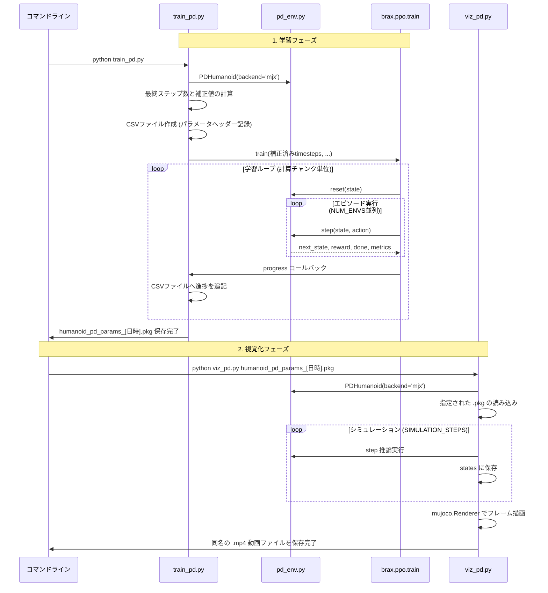

# 設計仕様書 (Design.md)

**【AIアシスタントへの引き継ぎ事項】**
本ドキュメントは、Google MuJoCo MJXおよびBraxを用いた人型ロボットの強化学習プロジェクトの仕様書です。以後のコード修正や開発を担当するAIは、本ドキュメントの「技術スタック」「JAX/MJX特有の制約」「観測・行動・報酬の定義」を熟読し、既存のアーキテクチャを破壊しないよう実装を進めてください。

---

## 0. プロジェクト前提条件（AI用コンテキスト）

### 0.1 技術スタック
- **言語**: Python 3.10+
- **物理エンジン**: Google MuJoCo MJX (GPUネイティブなMuJoCo)
- **強化学習ライブラリ**: Brax (PPOアルゴリズムを使用)
- **数値計算**: JAX (自動微分およびXLAコンパイル)
- **環境ベース**: `brax.envs.PipelineEnv` を継承

### 0.2 コーディング上の厳格な制約 (JAX/JIT)
本環境の `step` および `reset` 関数は `jax.jit` によってコンパイルされます。以後のコード修正において、AIは以下の制約を厳守すること。
1. **Python標準の制御構文（`if`, `for`, `while`）を使用しない**。条件分岐には必ず `jax.lax.cond` または `jax.numpy.where` を使用すること。
2. **ミュータブルな状態変更を行わない**。配列の更新は `x = x.at[i].set(val)` の形式で行うこと。
3. **辞書からのデータ取得とデフォルト値**。`getattr` や辞書の `get` を用いる際、型エラーを防ぐため必ず対象となるデータ型と合わせた初期値を指定すること。
4. **計算の混合精度適用**。指数関数や多重な演算による逆伝播時のVRAM肥大化を防ぐため、新規の報酬・ペナルティの計算ブロックは `jnp.bfloat16` にキャストして実行し、最終的に `jnp.float32` へ復元すること。

---

## 1. 環境定義と物理設計 (pd_env.py)

### 1.1 観測と行動 (Observation & Action)
- **行動 (Action)**: 17次元の連続値 `[-1.0, 1.0]`。胴体（3）、脚部（8）、腕部（6）の各関節の目標角度に対するスケール値として機能します。
- **観測 (Observation)**: ロボットの各関節の角度、角速度、胴体の位置・回転（四元数）、重心位置などの物理状態。

### 1.2 制御方式と主要パラメータ
各関節に対してトルクを直接与えるのではなく、目標角度と現在角度の差分を用いた **PD制御（比例・微分制御）** を採用しています。
- **PD制御の数式**: 
  $\tau = K_p (\theta_{\text{target}} - \theta_{\text{current}}) - K_d \dot{\theta}_{\text{current}}$
- **主要な制御パラメータ**:
  - `KP_GAIN` (比例ゲイン): 60.0
  - `KD_GAIN` (微分ゲイン): 5.0
  - `ACTION_LIMIT`: 0.8 (目標角度の最大可動域)
  - 部位別トルク上限: `TARGET_MAX_TORQUE_TORSO`, `TARGET_MAX_TORQUE_LEG`, `TARGET_MAX_TORQUE_ARM` を個別に設定し、17次元の配列として要素ごとのクリップ処理を実行。

### 1.3 現在の報酬関数 (Reward Function)
ロボットが直立姿勢を維持するための報酬・ペナルティ設計です。

1. **姿勢報酬 (Upright Reward)**: 胴体のZ軸方向ベクトルの内積。直立しているほど高報酬。
2. **高度報酬 (Height Reward)**: 目標高度（1.2m）に対する放物線近似（指数関数を排除）。目標高度に近いほど高報酬。
3. **生存報酬 (Healthy Reward)**: 転倒高度（0.7m）を下回る、または異常な浮き上がり（2.5m）を上回らない限り毎ステップ加算される。
4. **制御コスト (Control Cost)**: 行動（出力）および速度のL1ノルムによるペナルティ。無駄な動きやエネルギー消費を抑制する。
5. **中腰ペナルティ (Crouch Penalty)**: 目標高度を下回る一次元の差分に対する線形ペナルティ。生存高度ギリギリでしゃがみ込んで報酬を稼ぐ「報酬ハック」を防止する。

---

## 2. 実装済みの機能（Phase 1: 姿勢維持の獲得）

現在、Phase 1の開発として以下の機能が実装済みです。以後のコード改修時もこのロジックを破壊しないこと。

- **Domain Randomization（初期状態のランダム化）**
  ロボットを空中のランダムな高さから落下させ、姿勢や速度にも微小なノイズを付与しています。
  ※【注意】MJCF（物理モデル）の崩壊を防ぐため、四元数（クォータニオン `qpos[3:7]`）には絶対にノイズを付与しないこと。
- **JAXの型制約と状態管理（Metrics等の保護）**
  状態変数やMetricsを管理する際は、JAXのコンパイル制約を満たすため、`reset` 関数で必ず `jnp.float32` 型等として明示的に初期化すること。`step` 関数内でも、Pythonの `1` ではなく `jnp.array(1.0)` 等を用いて厳密な型の一致を保つように設計されています。
- **終了フラグ（done）等のキャスト**
  転倒判定（`is_fallen`）などの条件式を評価する際、そのままでは `bool` 型になるため、必ず `jnp.where` を用いて `float32` の `1.0` または `0.0` にキャストしてから `done` フラグ等として返却しています。

---

## 3. train_pd.py (学習実行モジュール)

BraxのPPOエージェントを用いて、シミュレーション内で並列学習を行います。

### 3.1 計算チャンクとステップ数の厳密な補正
学習の進行は以下の単位で計算されます。
- **1回の計算チャンク**: `NUM_ENVS(256) * UNROLL_LENGTH(128) * action_repeat(4)`
- **Brax内部ループのハック**: Braxは内部で `action_repeat` を考慮せずにループ回数を計算・切り上げしてしまう仕様があります。ログに表示された「最終ステップ数」と実際の学習回数を一致させるため、`ppo.train` の `num_timesteps` 引数には「最終ステップ数 ÷ action_repeat」の逆算補正を行った数値を渡す設計になっています。

### 3.2 タイムスタンプによるファイル管理とログ出力
実行ごとに現在時刻（例: `20260322_120000`）を取得し、以下のファイルを自動生成します。
1. **モデルパラメータ (`humanoid_pd_params_[日時].pkg`)**: 学習済みのネットワークの重み。
2. **学習ログ (`humanoid_pd_params_trainlog_[日時].csv`)**: 実行時の各種ハイパーパラメータをヘッダーに記録し、ステップごとの報酬・生存長・経過時間を追記保存するCSVファイル。

---

## 4. viz_pd.py (視覚化モジュール)

学習済みパラメータ (`.pkg`) を読み込み、`mujoco.Renderer` を用いてMP4動画を生成します。

- **引数による動的ファイル指定**: スクリプト実行時、コマンドライン引数（`sys.argv[1]`）から読み込む `.pkg` ファイルを指定する仕様です。
- **同名動画の自動出力**: 指定された `.pkg` ファイル名から拡張子を `.mp4` に置換し、対応関係が明確な動画ファイルをカレントディレクトリに出力します。

---

## 5. モジュール間の連携と処理フロー (UML)

