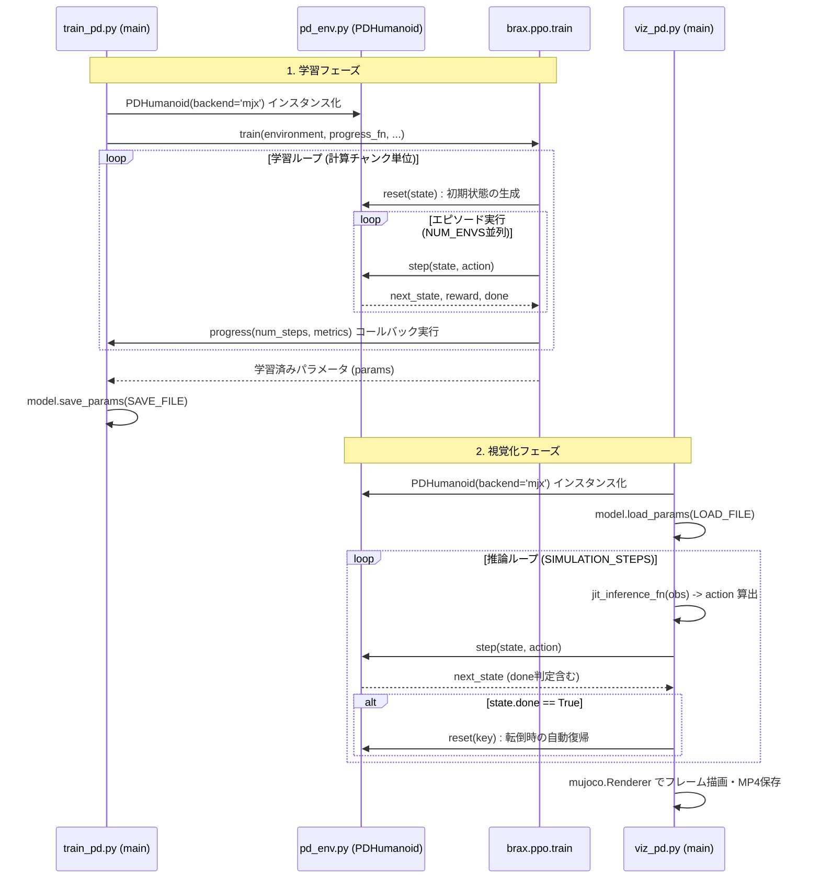

# 設計仕様書 (Design.md)

**【AIアシスタントへの引き継ぎ事項】**
本ドキュメントは、Google MuJoCo MJXおよびBraxを用いた人型ロボットの強化学習プロジェクトの仕様書です。以後のコード修正や開発を担当するAIは、本ドキュメントの「技術スタック」「JAX/MJX特有の制約」「観測・行動・報酬の定義」を熟読し、既存のアーキテクチャを破壊しないようPhase 1の実装を進めてください。

---

## 0. プロジェクト前提条件（AI用コンテキスト）

### 0.1 技術スタック
- **言語**: Python 3.10+
- **物理エンジン**: Google MuJoCo MJX (GPUネイティブなMuJoCo)
- **強化学習ライブラリ**: Brax (PPOアルゴリズムを使用)
- **数値計算**: JAX (自動微分およびXLAコンパイル)
- **環境ベース**: `brax.envs.PipelineEnv` を継承

### 0.2 コーディング上の厳格な制約 (JAX/JIT)
本環境の `step` および `reset` 関数は `jax.jit` によってコンパイルされます。以後のコード修正において、AIは以下の制約を厳守すること。
1. **Python標準の制御構文（`if`, `for`, `while`）を使用しない**。条件分岐には必ず `jax.lax.cond` または `jax.numpy.where` を使用すること。
2. **ミュータブルな状態変更を行わない**。配列の更新は `x = x.at[i].set(val)` の形式で行うこと。
3. **NumPy (`np`) を直接使用しない**。計算はすべて `jax.numpy` (`jnp`) を使用すること。

---

## 1. pd_env.py (環境定義モジュール)
人型ロボットの物理シミュレーション環境と、関節制御（PD制御）のロジックを定義します。

### 1.1 空間定義 (Space Definitions)
- **観測空間 (Observation Space)**: AIへの入力。
  - 構成: 胴体のローカル座標系における速度、重心位置、各関節の角度（`qpos`）、および角速度（`qvel`）。
  - 型: `jax.numpy.ndarray` (1次元ベクトル)
- **行動空間 (Action Space)**: AIからの出力。
  - 構成: 各関節の「目標角度」を指定するベクトル。
  - 範囲: `-1.0` 〜 `1.0` (内部で `ACTION_LIMIT` 倍され、実際のラジアン角に変換される)。

### 1.2 制御方式と主要パラメータ
AIが出力した目標角度に対し、以下のPD制御則を適用してトルク $\tau$ を算出します。
$\tau = K_p (\theta_{target} - \theta_{current}) - K_d \dot{\theta}$

| 変数名 | 意味 | 入力制限 / 目安 |
| :--- | :--- | :--- |
| `KP_GAIN` ($K_p$) | 比例ゲイン。関節を目標に引き戻すバネの強さ。 | 30.0 〜 100.0（300超は数値発散によるシミュレーション破綻を招く） |
| `KD_GAIN` ($K_d$) | 微分ゲイン。動きの振動を抑える制動力。 | 0.5 〜 10.0（$K_p$ の10%〜20%程度） |
| `ACTION_LIMIT` | AIが指定できる目標角度の最大範囲。 | 0.1 〜 1.0（1.0で約57度） |
| `FALL_HEIGHT` | 転倒と判定する頭部の最低高さ。 | 0.5 〜 0.8m |
| `FLY_HEIGHT` | 異常浮上判定（報酬ハック対策）。 | 2.0m 前後 |

### 1.3 現在の報酬関数 (Reward Function)
現在（初期実装）の `step` 関数では以下の合計を報酬として返しています。
1. **前進報酬**: `forward_reward = forward_velocity * FORWARD_WEIGHT`
2. **生存報酬**: `healthy_reward = HEALTHY_REWARD` (転倒していない場合に付与)
3. **制御コスト**: `ctrl_cost = sum(action^2) * CTRL_COST_WEIGHT` (減点)
4. **ペナルティ**: 転倒または異常浮上時に `PENALTY_REWARD` (例: -50.0) を付与し、エピソードを終了(`done=True`)。

---

## 2. 次フェーズ (Phase 1: 姿勢維持) の開発要件
引き継ぎ先のAIは、上記の `pd_env.py` を改修し、以下の「外乱に耐えて直立を維持する」仕様に変更してください。

### 要件A: 報酬関数の再設計
「前に進むこと」ではなく「その場に立ち続けること」を評価するよう報酬を変更します。
- **削除**: 前進報酬 (`forward_reward`) を完全削除。
- **追加 (姿勢報酬)**: 胴体（torso）のZ軸方向のベクトルが、ワールド座標のZ軸（上方向）と一致している度合い（内積など）を計算し、直立に近いほど高い報酬を与える。
- **追加 (高さ報酬)**: 頭部の高さが特定の目標値（例: 1.5m）に近いほど高い報酬を与える。

### 要件B: ドメインランダマイゼーション (Domain Randomization) の導入
`reset` 関数を改修し、エピソード開始時の初期状態をランダム化します。
- **空中からの落下**: 初期高度（Z座標）を 1.0m 〜 2.0m の間でランダムに設定。
- **初期姿勢のランダム化**: 各関節の初期角度（`qpos`）に、微小なノイズ（一様分布など）を乗算して初期化。
  - *実装時の注意*: JAXの擬似乱数生成器 (`jax.random.split`, `jax.random.uniform`) を正しく使用し、JITコンパイルに準拠させること。

---

## 3. train_pd.py (学習実行モジュール)
| 変数名 | 意味 | 入力制限 / 目安 |
| :--- | :--- | :--- |
| `TOTAL_TIMESTEPS` | 学習の総試行回数（目標値）。 | 1,310,720 の倍数を推奨 |
| `NUM_ENVS` | GPU上の並列個体数。 | 1024 〜 4096（VRAMに依存） |

**【AIへの注意点: 計算チャンクの仕様】**
GPU効率化のため、内部で `NUM_ENVS * 20 * NUM_MINIBATCHES` （デフォルトで 1,310,720 ステップ）が最小の計算単位となります。設定値がこの倍数でない場合、実際の終了ステップ数は自動的に切り上げられます（例: 15,000,000 指定時は約 28,835,840 で終了）。進捗バーや評価ログの出力タイミングもこのチャンクに依存します。

---

## 4. viz_pd.py (視覚化モジュール)
学習済みパラメータ (`.pkg`) を読み込み、`mujoco.Renderer` を用いてMP4動画を生成します。
- **自動リセット**: 推論ループ内で `state.done` が `True` になった場合、即座に `reset` を呼び出し、シミュレーションを継続させるロジックが組み込まれています。

---

## 5. モジュール間の連携と処理フロー (UML)

